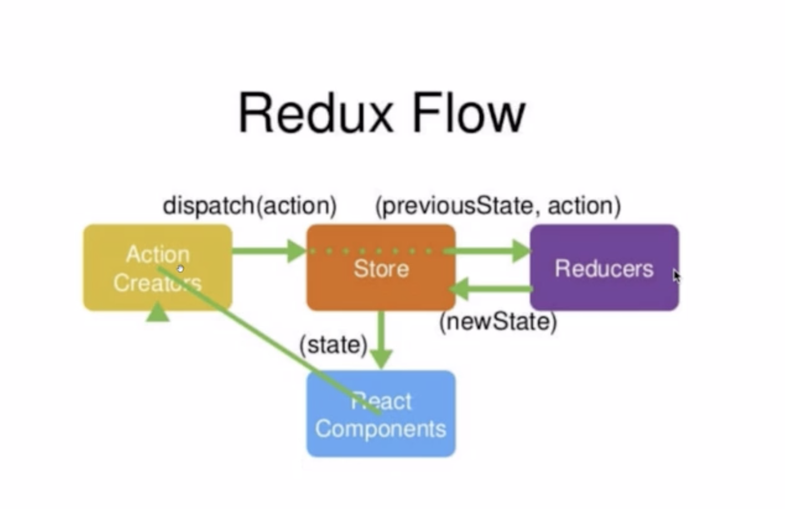

# 创建基本的webpack 项目
1. 在项目根目录创建src 源代码目录和dist产品目录
2. 在src 下创建index.html
3. npm install --save webpack -D
4. 

# JSX
html还是最优秀的标记语言
使用babel来转换这些JS的标签
这种在JS中，混合写入类似html的语法 叫做JSX语法
注意JSX语法的本质 还是运行的时候 还是被React.createElement的形式来执行

1. 安装babel
npm install --save babel-core babel-loader babel-plugin-transform-runtime -D
npm install --save babel-preset-env babel-preset-stage-0 -D
npm install --save babel-preset-react -D
```javascript 1.6
    module : {
        rules: [
            {test: /\.js|jsx$/, use: 'babel-loader', exclude: '/node_modules/'},  //千万不要忘记添加exclude
        ]

    }
```
.babelrc
```javascript 1.6
{
  "presets"：["@babel/preset-env", "@babel/preset-react"]

}
```

babel-react 把js jsx 中html翻译成React.createElement

`jsx中的html元素 已经变成了对象`

## JSX 语法
1. react 解析到html的时候就会交由babel-react进行处理 转换成react createElement。。。
2. {} 会用js 变量代替
3.  JSX创建DOM的时候 所有的根节点必须有唯一的根元素进行包裹
4.  如果需要使用class 不能直接使用 需要使用className 来替代class htmlFor 替换label的for属性
5. ```
    {...user}  -> name={user.name} ....`
  
    ```
## 创建组件
```javascript 1.6
    // 第一种创建组件的方式 第一个字幕必须大写
    function Hello(props) {
    
        // 如果在一个组件中return 一个null 表示次组件是空的 什么都不渲染
        // return null;
        //在组件中必须返回一个合法的虚拟DOM元素
    
        console.log(props);
        return <div>hello {props.user.name}, he has {props.user.age}</div>
    }
    
    // 
    
    <div>
        <Hello user={user}/>
    </div>
    
```
```javascript 1.6

    resolve: {

        extensions : ['.js', '.jsx', '.json'], // 默认帮你补全文件的后缀名
        alias: {
            '@' :path.join(__dirname, './src')  //这样@就表示项目根目录src的这一层
        }

    }

```

## class 创建组件

用class 创造出来的组件叫做有状态组件

有状态组件和无状态组件怎样区分 本质区别就是 ：有无state属性

用function 建出来的组件是没有state 的 所以是无组件的

* 如果一个组件需要有自己的私有数据 则推荐使用class
* 若果一个组件不需要有私有数据 则推荐使用无状态组件

props中的数据都是外界传递过来的
state 中的数据都是组件私有的（通过ajax获取来的数据，一般都是私有数据）
props 中的数据都是只读的 stat中的数据都是可读可写的

this.props.children 可以得到自己的子组件

## function创建组件
可以使用hook来为function组件 创建state 状态


## 加载css文件
npm install --save styleloader css-loader -D

## 为什么要用this
```typescript jsx
 <Input value={this.state.searchTaskKeywords} onChange={this.handleChange} />
 
 // 因为这个方法是实例方法
 // 也不能this.handleChange() 因为我不直接执行
 
 handleChange = () => {
     this.setState({})
 }
 
 // 这里必须要用箭头函数 this 指针才能指向 该组件实例
```

this.setState({}) 不会覆盖那些不传的

// 生命周期
//  创建前
static.defaultProps 这个是在创建之间 预设的值

//  创建
1. this.state= {}
2. componentWillMount()
3. render()  这步是放到内存里面
4. componentDidMount() 这步是放到页面上 完成挂载

// 运行中
一旦status 或者props 改变

props改变 - componentWillReceiveProps - shouldComponentUpdate
state改变 - shouldComponentUpdate

- componentWillUpdate - render - componentDidUpdate

// 卸载
componentWillUnmount


## Fragment
React.Fragment <> </>
可以用来做空标签 不需要实体标签做第一个装载

## context 用来在组件之间进行交流
首先使用createContext 方法来创建一组供应者和消费者
```javascript 1.6
const {Consumer , Provider } = React.createContext();

```

provider 用来提供状态 其实它也是一个组件 这个组件返回一个供应者（上面一个命令做出来的） 并且将自己的状态以
value的值方式给它
```javascript 1.6
export  class CounterProvider extends React.Component {
    constructor() {
        super();
        this.state = {
            count : 10000,

        }
    }
    render() {
        return <Provider value={{
            count : this.state.count,
            x: 1,
            onIncreaseCount : this.increaseCount,
            onDecreaseCount : this.decreaseCount
        }}>
            {this.props.children}
        </Provider>
    }

    increaseCount = () =>{
        this.setState({
            count : this.state.count +1
        })
    }

    decreaseCount = () => {
        this.setState({
            count : this.state.count - 1
        })
    }
}

```

任何一个想使用这个供应者的组件 可以使用第一个命令创建出来的消费者得到状态

```javascript 1.6
class Counter extends React.Component {
    render() {
        return <Consumer>
            {
                ({count}) => {

                    return <span>{count}</span>
                }
            }

        </Consumer>
    }

}

```

## Redux

1. reducer 必须是一个纯函数
* 纯函数的意义就是它不能因为外界的因素影响执行 比如在函数中使用ajax调用 这样不确定结果的数据
* 它接受先前的state￿ 和 action 并返回新的state 
2. state 被存储在一个object tree 当中 这个object tree只能存在唯一的store中
3. action是一个用于描述发生事件的普通对象

- 创建reducers￿
```javascript 1.6
export  default (state = initState, action) => {
    switch (action.type) {
        case ActionType.CART_AMOUNT_INCREMENT:
            return state.map(item => {
                if(item.id == action.payload.id) {
                    console.log(item.amount);
                    item.amount += 1;
                }
                return item;
            });
            break;
        case ActionType.CART_AMOUNT_DECREMENT:
            return state.map(item => {
                if(item.id == action.payload.id) {
                    item.amount -= 1;
                }
                return item;
            });
            break;
        default:
            return state
    }
}
```
- 合并reducers
```javascript 1.6
export default combineReducers({
    cart,
    inputReducer
})
```
- creatStore
```javascript 1.6
const composeEnhancer = window.__REDUX_DEVTOOLS_EXTENSION__? window.__REDUX_DEVTOOLS_EXTENSION_COMPOSE__({}): compose

const enhancer = composeEnhancer(applyMiddleware(thunk))

const store = createStore(reducer, enhancer);

export default store;
```
- provide store={store}
 ```javascript 1.6
   <Provider store={store}>
        <ToDoList></ToDoList>
   </Provider>
   ``` 
   用react-redux的Provider来给所有子节点提供store
   
- connect(mapStateToProps, {...actionCreators}) (YourComponent)
2. ```javascript 1.6
   const mapStateToprops = (state) => {
   
        return {
            cartList :  state.cart
   
        }
   }
   
   const mapDispatchToProps  = (dispatch) => {
        return {
            add : (id) => dispatch(increment(id)),
            remove: (id) => dispatch(decrement(id))
        }
   }
   
   export default  connect(mapStateToprops, mapDispatchToProps)(CartList)
 
   class  CartList extends Component {
   
       constructor(props) {
           super();
   
           this.state = {
               cartList : props.cartList
           }
       }
   
   } 
   ```
   * 在对外暴露组件时 使用react-redux提供的connect方法 就可以使用this.props中直接去使用了
   * connect方法有4个参数 常用的是前两个
   * 第一个参数是mapStateToProps 作用就是从store里把state注入到当前组件的props上
   * 第二个参数是mapDispatchToprops 这个主要作用是把action生成的方法注入到当前组件的props上去 一般来说也没有必要这样用
   * 直接第二个参数传递一个对象，这里面的对象就是actionCreators，只要传入了actionCreators，在组件内就通过
   this.props.actionCreator来调用，在调用之后那个actionCreator就会自动把它内部的action dispatch出去
- actionType
```
export const CHANGE_INPUT_VALUE=  'changeInputValue';
export const ADD_INPUT_VALUE=  'addInputValue';
export const REMOVE_INPUT_VALUE=  'removeInputValue';
export const GET_INPUT_LIST_VALUE=  'getInputListValue';

export const CART_AMOUNT_INCREMENT = 'CART_AMOUNT_INCREMENT';
export const CART_AMOUNT_DECREMENT = 'CART_AMOUNT_DECREMENT';
```
定义actiontype 类型 避免在下面actionCreator 还有在reducer里面写错了
- actionCreators

```javascript 1.6
export const getInputListAction = (data) => {
    return {
        type: ActionTypes.GET_INPUT_LIST_VALUE,
        value: data
    }
}
```
 这样在dispatch使用的时候就不会用错action

- 修改reducer 

actionCreator => 自动dispatch(actionCreator()) => reducer => store => view

actionCreator => middleware 处理生成新的action => 手动dispatch(actionCreator()) => reducer => store => view

###  redux thunk
* 可以采用异步的访问
*
### container 和 component
* container 直接访问redux 调取state
* component 不直接和redux进行交互


## Router

￿￿1. 在最外层使用Router 组件
```javascript 1.6

<Router>
    <Route component={App} path={"/"}></Route>
</Router>
````
2. 然后在其他所有的内部组件可以用route 组件设置路径
````javascript 1.6
<div>
    <ul>
        <li> <Link to={"/user"}>user</Link> </li>
        <li><Link to={"/article"}>article</Link></li>
    </ul>
</div>
<Switch>
    <Route component={Article} path={"/article"} exact></Route>
    <Route component={ArticleDetail} path={"/article"}></Route>
    <Route component={User} path={"/user"}></Route>
    <Redirect to={"/"} from={"/"}></Redirect>
</Switch>
````
3. 加上switch之后就会 进行匹配一次就结束
4. exact 表示完全匹配 这样子路由就很好
5. 所有皆组件
6. 在被路由的组件里面 通过props去访问 {this.props.match.params.xxx}
7. 除了用component 来引导 还可以用render 方法来引导
   好处是 可以传递参数 而且可以做登陆
```
<Route render={(routeProps) => { return this.state.isLogin === true ? <div>Not login</div> : <div>render</div>}} 
      path={'/render'} exact>
</Route>
```


### 路由传参的几种方式
1. query
2. 动态路由 /path/:param
3. 使用state 隐式传参 埋点 埋下统计的点

### 在代码中路由
* ￿￿￿ 导入 
```javascript 1.6
import {RouteComponentProps, withRouter} from 'react-router-dom'
```
* props接口需要 继承 RouteComponentProps
```javascript 1.6
interface ArticleProps extends RouteComponentProps {
}
```
* 导出的时候需要
```javascript 1.6
export default withRouter(Article);
```
* 最后在代码中可以用 history 进行路由操作 但是路由是
```javascript 1.6
this.props.history.push(`/admin/article/edit/${record.id}`)
```
### 在代码中得到路由参数
* RouteComponentProps 给定制一个接口范型 这个接口范型 必须满足有一个name属性 ，然后我们可以加上自己的属性
```javascript 1.6
interface MatchParams {
    name: string;
    id: string;
}

interface ArticleEditProps extends RouteComponentProps<MatchParams> {

}


interface ArticleState {

}
class ArticleEdit extends Component<ArticleEditProps, ArticleState> {

    constructor(articleEditProps: ArticleEditProps) {
        super(articleEditProps);
    }

    componentDidMount(): void {
        console.log(this.props.match.params.id);
       // getArticleById(this.props.match.params)
    }
}
```
## react-app-rewired

## 建立新的项目
* yarn create react-app antd-demo --template typescript 
* 这个使用react-script来绑定webpack 并进行默认的配置
* 如果没有特殊情况可以不需要修改

## 实现富编辑器的原理
* 不使用textarea 而是div
* div有一个contenteditable属性 可以让它变成一个可编辑的区域 而且识别html标签
```html
<div contenteditable border="1 px solid">

</div>
```

## 当前流行的 前端图形框架
* 游戏 Egret engine2D
* antv hightcharts d3
* datav
    